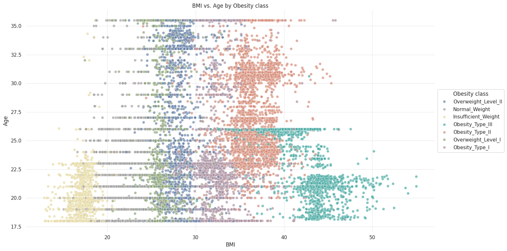
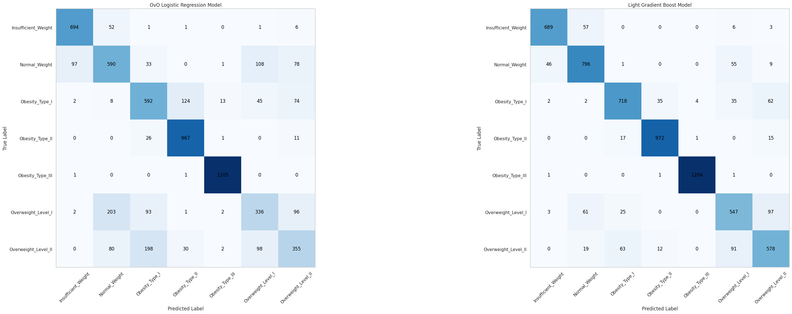
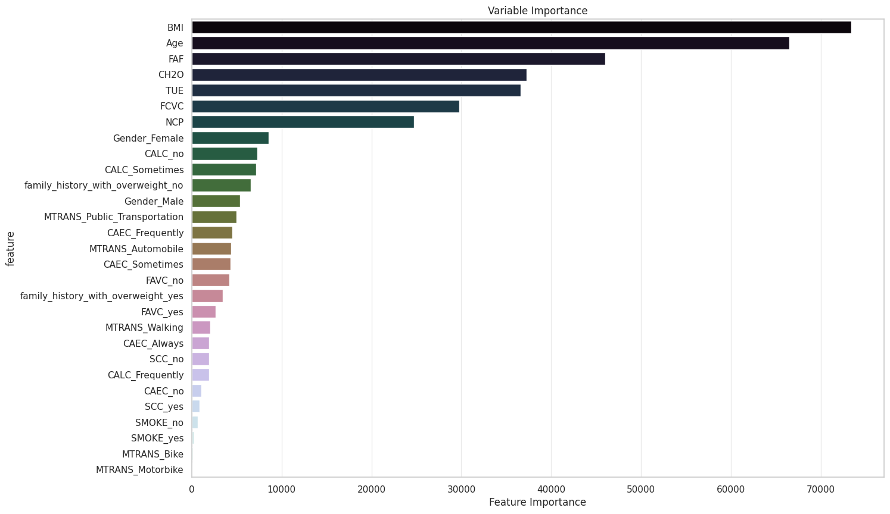

## Obesity Risk Multiclass Prediction
## Project Overview

This project aims to develop a predictive model to classify obesity levels based on various health indicators and demographics. The model utilizes data from medical records and patient demographics, including age, gender, BMI, diet, physical activity, and other relevant health metrics. The final Light Gradient Boosting model achieved an accuracy of 88% on the validation data, demonstrating its effectiveness in predicting obesity risk.

## Business Understanding

Obesity is a significant public health concern, and early detection and management of obesity-related risk factors are crucial. The stakeholders for this project include healthcare providers, researchers, and policymakers. The business problem addressed is the efficient processing of patient data to identify and manage obesity-related risk factors, which currently involves manual review and analysis. Our predictive model aims to automate this process, thereby increasing response time and improving overall system efficiency.

## Data Understanding

The dataset used for this project consists of various features related to patient health indicators and demographics. These include age, gender, BMI, diet, physical activity, and other relevant health metrics. Despite the presence of missing data in some columns, the dataset appears to be in a consistent format.
Modeling and Evaluation

Two machine learning models were developed for this project: a Regularized Logistic Regression model and a Light Gradient Boosting model. Both models were evaluated using several metrics including accuracy, precision, recall, and F1 score. The Light Gradient Boosting model achieved an accuracy of 88% on the validation data, demonstrating its effectiveness in predicting obesity risk.

### Model comparison

## Feature Importance

The feature importance analysis revealed which health indicators and demographics have the most significant impact on the prediction of obesity risk. This information can be used to prioritize interventions and tailor healthcare strategies.

## Conclusion

The predictive model developed in this project effectively classifies obesity risk based on various health indicators. This model can automate the initial stages of the obesity management process, thereby increasing response time and improving overall system efficiency. Future steps to expand on this project could include refining the model to handle more complex scenarios, or integrating it into a broader healthcare system for real-time risk assessment.
